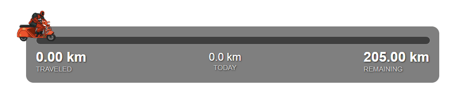

# Trip Overlay for RTIRL

A professional real-time GPS tracking overlay for live streaming cycling trips. **Now built with React + TypeScript + Vite** for modern development while maintaining 100% backward compatibility. Perfect for IRL streamers using RTIRL to show their journey progress with beautiful visuals and accurate distance tracking.

### **🎯 Modern Architecture**
- **React 19** + **TypeScript** + **Vite** for type-safe, fast development
- **Zustand** state management + **React Query** for server state
- **Tailwind CSS** for responsive, modern styling
- **100% Backward Compatible** - All console commands and URL parameters work identically

## 📄 **License & Commercial Use**

**TripOverlay is dual-licensed:**

### 🆓 **Non-Commercial License (Free)**
Perfect for hobby streamers and personal projects:
- ✅ Personal streaming (no monetization)
- ✅ Educational use  
- ✅ Open source projects
- ✅ Learning and experimentation

### 💼 **Commercial License (Paid)**
Required for any revenue-generating use:
- 💰 Monetized streaming (donations, subs, sponsorships, ads)
- 💰 Professional streaming services
- 💰 Commercial streaming platforms
- 💰 Revenue-generating applications

**Need a commercial license?** Contact: **licensing@tripoverlay.dev**

---

## **🔍 Quick Navigation**

**🖥️ Local OBS Users:** This README has everything you need  
**☁️ IRLToolkit Cloud Users:** Jump to [IRLTOOLKIT-GUIDE.md](./IRLTOOLKIT-GUIDE.md) ⚠️ _Limited backup restore_  
**💾 Backup/Restore Help:** See [BACKUP-GUIDE.md](./BACKUP-GUIDE.md)  
**🔧 Feature Comparison:** See [COMPATIBILITY.md](./COMPATIBILITY.md)

### **🚀 Getting Started**

- [Preview](#preview) - See the overlay in action
- [Features](#features) - Real-time GPS tracking & smart distance calculations
- [Quick Start](#quick-start) - Set up in 5 minutes

### **🎛️ Control Methods**

- [Configuration Options](#configuration-options) - Distance settings & GPS protection
- [Control Options by Setup Type](#control-options-by-setup-type) - Local vs Cloud differences
- [Manual Controls](#manual-controls-for-irltoolkitcloud-environments) - URL parameters & hotkeys

### **🎥 Streaming Setup**

- [Recommended Hosting: GitHub Pages](#recommended-hosting-github-pages) - Best for reliability
- [IRLToolkit + GitHub Pages Setup](#irltoolkit--github-pages-professional-streaming-setup) - Cloud streaming workflow
- [Troubleshooting](#troubleshooting) - Common issues & solutions

### **🔧 Advanced Features**

- [True Cross-Device Persistence](#true-cross-device-persistence-solutions) - Cloud storage options
- [Robust Edge Case Handling](#robust-edge-case-handling) - GPS protection & error handling
- [Technical Details](#technical-details) - How it works under the hood

### **🎨 Customization & Development**

- [Customization](#customization) - Colors, fonts, positioning
- [Testing Without RTIRL](#testing-without-rtirl) - Development & testing
- [Example Use Cases](#example-use-cases) - Real-world applications
- [Development Setup](#development-setup) - Code quality tools & contributing

**🎯 Most Common Actions:**

- **Daily Reset**: Console: `resetTodayDistance()` / IRLToolkit: `?reset=today`
- **New Trip**: Console: `resetTripProgress()` / IRLToolkit: `?reset=trip`
- **Backup**: Console: `exportTripData()` - See [BACKUP-GUIDE.md](./BACKUP-GUIDE.md) for help
- **All Commands**: See [API.md](./API.md) for complete reference

**⚡ Quick Links:**

- [IRLTOOLKIT-GUIDE.md](./IRLTOOLKIT-GUIDE.md) - Complete cloud workflow
- [BACKUP-GUIDE.md](./BACKUP-GUIDE.md) - Step-by-step backup & restore
- [COMPATIBILITY.md](./COMPATIBILITY.md) - Feature breakdown by setup
- [API.md](./API.md) - Console functions & URL parameters reference
- [CONTRIBUTING.md](./CONTRIBUTING.md) - Developer guide & project setup

**📋 Table of Contents:**

- [Preview](#preview)
- [Features](#features)
- [Perfect For](#perfect-for)
- [Quick Start](#quick-start)
  - [1. Get Your RTIRL User ID](#1-get-your-rtirl-user-id)
  - [2. Configure Your Trip](#2-configure-your-trip)
  - [3. Choose Your Hosting Method](#3-choose-your-hosting-method)
  - [4. Add to OBS](#4-add-to-obs)
  - [5. Make Background Transparent for OBS](#5-make-background-transparent-for-obs)
- [Configuration Options](#configuration-options)
- [Customization](#customization)
- [Testing Without RTIRL](#testing-without-rtirl)
- [Example Use Cases](#example-use-cases)
- [Development Setup](#development-setup)

## Preview



_The overlay in action - showing real-time distance tracking with animated cycling avatar_

## Features

- **Real-time GPS tracking** via RTIRL WebSocket API
- **Enhanced location services** with OpenCage geocoding API for accurate city/country display
  - **Multi-provider fallback**: OpenCage (primary) → Nominatim (free) → Coordinates (failsafe)
  - **Smart caching**: 5-minute cache with 100m radius zones (80% reduction in API calls)
  - **Sub-second performance**: 5-10x faster than previous implementation
  - **Progressive loading**: "GPS Connected - Getting location..." → City name (no more "--")
- **Animated cycling avatar** that moves along the progress bar
- **Distance tracking**: Total traveled, daily distance, and remaining distance
- **GPS drift protection** - filters out stationary GPS noise
- **Progress persistence** - keeps your distance progress across stream sessions
- **Smart daily reset** - intelligent day detection with 6-hour grace period for midnight streaming
- **Robust error handling** - validates GPS data and handles edge cases gracefully
- **Professional styling** with semi-transparent backgrounds and clean typography
- **OBS-ready** with transparent background support
- **Responsive progress bar** that updates as you travel
- **Accurate distance calculations** using the Haversine formula
- **Timestamped Logging**: Centralized, timestamped, and leveled logging for easier debugging.
- **`setTotalTraveled` URL Parameter**: Easily set total trip distance via URL.

## Perfect For

- Motorbike road trips and adventures
- Cross-country travel streams
- City-to-city journey documentation
- Multi-day touring expeditions
- Any GPS-based travel content

## Quick Start

### **🆕 React + TypeScript Version (Recommended)**

1. **Clone and Install**:
   ```bash
   git clone https://github.com/kevintongg/trip-overlay.git
   cd trip-overlay
   pnpm install
   ```

2. **Configure Environment**:
   Create `.env.local`:
   ```env
   VITE_RTIRL_USER_ID=your_rtirl_user_id
   VITE_DEMO_MODE=false
   ```

3. **Start Development**:
   ```bash
   pnpm dev
   # Open http://localhost:5173/index-react.html
   ```

4. **Get Your RTIRL User ID**:
   - Go to [rtirl.com](https://rtirl.com) and find your profile ID
   - Update `VITE_RTIRL_USER_ID` in `.env.local`

### **📂 Legacy Vanilla JS Version**

For the original vanilla JavaScript version, see the backup files:
- `index.html` and `dashboard.html` 
- Configure in `js/script.js` if using legacy version

### **⚙️ Trip Configuration**

Edit `src/utils/config.ts` for trip settings:
```typescript
export const CONFIG = {
  trip: {
    totalDistanceKm: 371.0, // Vienna to Zagreb
    useAutoStart: false,
    manualStartLocation: { lat: 48.209, lon: 16.3531 },
  },
  // ... other settings
};
```

The system automatically detects start location and movement type (walking, cycling, vehicle) based on your speed.

For more advanced configurations, such as setting a different total distance on the fly, you can use URL parameters. For example, to set the total distance to 500km, you would add `?totalDistance=500` to your URL.

### 3. Choose Your Hosting Method

**Option A: Local File (Recommended for Development)**

- Use the HTML file directly: `file:///path/to/trip-overlay/index.html`
- ✅ **No server needed** - just double-click the HTML file
- ✅ **All features work** - RTIRL connection, localStorage, demo mode
- ⚠️ Progress tied to exact file location

**Option B: Local Web Server (Optional - Usually Not Needed)**

```bash
# Only use if you need specific server features:
cd trip-overlay
python -m http.server 8000  # Access at: http://localhost:8000
# OR
npx serve . -p 8000         # Access at: http://localhost:8000
```

- ❌ **Unnecessary overhead** for most development
- ✅ **Use only if:** Testing HTTPS features or production simulation
- ⚠️ Progress tied to that computer only

**Option C: Cloud Hosting (Best for Production)**

- Deploy to: Vercel, Netlify, GitHub Pages, etc.
- ✅ Accessible from any device
- ✅ Professional URLs for OBS
- ⚠️ Progress tied to that domain

### 4. Add to OBS

1. Add **Browser Source** in OBS
2. Set URL based on your chosen hosting method:
   - **Local file** (recommended):
     - Windows: `file:///C:/path/to/trip-overlay/index.html`
     - Mac/Linux: `file:///Users/username/trip-overlay/index.html`
   - **Local server** (if needed): `http://localhost:8000`
   - **Cloud hosting** (production): `https://yourdomain.com/trip-overlay/`
3. Set dimensions: **Width: 900px, Height: 200px**
4. Enable **Shutdown source when not visible**
5. Enable **Refresh browser when scene becomes active**

**💡 Tips:**

- For development, use the file:// URL - it's simpler and works perfectly with OBS!
- **To get the exact path:** Right-click `index.html` → Properties → Copy the full path, then add `file:///` at the beginning

### 5. Make Background Transparent for OBS

In `css/style.css`, ensure the transparent background is enabled:

```css
body {
  background-color: rgba(0, 0, 0, 0); /* Transparent for OBS */
  /* Comment out any test background images */
}
```

## Configuration Options

### Centralized Configuration

All settings are now managed in `utils/config.js` for easy customization:

```javascript
export const CONFIG = {
  // Trip Settings
  trip: {
    totalDistanceKm: 371.0, // Distance from Vienna to Zagreb
    useAutoStart: false,
    manualStartLocation: { lat: 48.209, lon: 16.3531 }, // Vienna
  },

  // RTIRL Integration
  rtirl: {
    userId: '41908566', // Replace with your RTIRL user ID
    demoMode: false,
  },

  // Movement Detection (Optimized for Cycling)
  movement: {
    modes: {
      STATIONARY: { maxSpeed: 2, minMovementM: 1, gpsThrottle: 5000 },
      WALKING: { maxSpeed: 10, minMovementM: 1, gpsThrottle: 2000 },
      CYCLING: { maxSpeed: 35, minMovementM: 5, gpsThrottle: 1500 },
    },
    modeSwitchDelay: 10000, // 10 seconds
  },
};
```

### GPS Drift Protection

The overlay includes sophisticated filtering to prevent GPS drift from inflating your distances:

**Permissible Mode System:**

- ✅ **Stationary GPS drift** (1-8m) gets filtered out automatically
- ✅ **Real cycling movement** gets counted immediately
- ✅ **Walking around cafes/hotels** gets counted (realistic!)
- ✅ **Seamless mode transitions** - uses most permissive threshold during transitions
- ✅ **No distance overshoot** - distance caps at your planned total

### Movement Detection Examples

- **Stationary** (cafes, traffic lights): Ignores movements < 1m
- **Walking** (pushing bike, exploring): 1m threshold, up to 10 km/h
- **Cycling** (main travel): 5m threshold, up to 35 km/h
- **Permissible mode**: Uses higher threshold when transitioning between modes

### Enhanced Error Handling

- **Network resilience**: 8-10 second timeouts on all external APIs
- **Memory management**: Automatic cache cleanup prevents memory leaks
- **Input validation**: All URL parameters validated with appropriate limits
- **Graceful degradation**: Continues working when weather/geocoding services fail

### Progress Persistence

Your trip progress is automatically saved and restored across stream sessions:

**What Gets Saved:**

- ✅ **Total distance traveled** - never lost between streams
- ✅ **Today's distance** - smart daily reset with 6-hour grace period
- ✅ **Auto-detected start location** - consistent across sessions
- ✅ **Activity tracking** - knows when you were last active for intelligent resets

**Real-World Benefits:**

- 🍕 **Lunch break**: Stop stream, restart later - progress intact
- 🏨 **Hotel overnight**: Day 2 stream continues from Day 1 progress
- 🔄 **Connection issues**: Refresh overlay without losing data
- 🌙 **Midnight streaming**: Won't reset "today" distance mid-stream
- 🌍 **Timezone travel**: Handles Prague→Vienna timezone changes gracefully
- ⏰ **Smart resets**: Only resets after 6+ hours of inactivity on new calendar day

### ⚠️ Important: Hosting Limitations

**localStorage is tied to where you host the overlay:**

- **📁 Local file** (`file://`): Tied to exact file path
- **🖥️ Local server** (`localhost`): Only works on that computer
- **☁️ Cloud hosting** (`https://domain.com`): Tied to that domain
- **🎥 OBS Browser Source**: May have isolated storage context

**This means:**

- ❌ **Testing locally** → **deploying to cloud** = **lose progress**
- ❌ **Switching computers** = **lose progress**
- ❌ **Changing hosting method** = **lose progress**

### 💾 Manual Backup/Restore

**When you need this:**

- Switching hosting methods (local → cloud)
- Moving between computers or browsers
- Setting up overlay on new device
- Creating safety backups

**👉 For detailed step-by-step instructions, see [BACKUP-GUIDE.md](./BACKUP-GUIDE.md)**

#### Quick Commands

**Backup your progress:**

```javascript
exportTripData(); // Downloads backup file to Downloads folder
```

**Restore your progress:**

```javascript
importTripData(jsonString); // Shows dialog to paste backup data
```

**IRLToolkit users:** Use URL parameter `?export=true` for backup

**What gets saved:** Total distance, today's distance, unit preference, start location, activity data

### Starting a New Trip

To reset all progress for a new journey:

```javascript
resetTripProgress(); // Clears all saved data and starts fresh from 0km
```

### Better Persistence Solutions

For reliable cross-device/cross-hosting persistence, consider:

- **Supabase** (free tier): Real-time database with simple API
- **Firebase** (free tier): Google's cloud database
- **GitHub Gist**: Store JSON data in a private gist
- **Simple cloud storage**: Upload/download JSON files

These would require code modifications but provide true persistence across any hosting setup.

## Recommended Hosting: GitHub Pages

Deploy your overlay to GitHub Pages for reliable hosting:

### Quick GitHub Pages Setup:

1. **Create GitHub repository** for your overlay
2. **Upload your files** (index.html, css/, js/, assets/)
3. **Enable GitHub Pages** in repository Settings > Pages
4. **Access your overlay** at: `https://yourusername.github.io/trip-overlay/`

### Benefits:

- ✅ **Free hosting** with 99.9% uptime
- ✅ **SSL certificate** included
- ✅ **Consistent URL** - no more path changes
- ✅ **Global CDN** for fast loading worldwide
- ✅ **Version control** for easy updates
- ✅ **Professional URLs** perfect for OBS Browser Sources

### OBS Browser Source Setup:

```
URL: https://yourusername.github.io/trip-overlay/
Width: 900px
Height: 200px
✅ Shutdown source when not visible
✅ Refresh browser when scene becomes active
```

### ⚠️ localStorage Reality Check

**Important**: localStorage is still **local to each browser/device**, even with GitHub Pages hosting:

- ❌ **Different computers**: Hotel laptop ≠ home computer localStorage
- ❌ **Different browsers**: Chrome ≠ Firefox ≠ OBS Browser Source localStorage
- ❌ **Browser data clearing**: Lost when cache/data is cleared
- ❌ **Team streaming**: Can't share progress between people
- ❌ **Device switching**: Phone testing ≠ computer streaming localStorage

**GitHub Pages solves URL consistency, but localStorage is still browser-local.**

## True Cross-Device Persistence Solutions

For progress that truly persists across devices and browsers:

### Option 1: JSONBin.io (Simplest Cloud Storage)

1. **Get free account** at [jsonbin.io](https://jsonbin.io)
2. **Create a bin** and get your Bin ID and API key
3. **Enable cloud storage** in your configuration
4. **Configure your credentials**:
   ```javascript
   const CLOUD_STORAGE_URL = 'https://api.jsonbin.io/v3/b/YOUR_BIN_ID';
   const CLOUD_API_KEY = 'YOUR_API_KEY';
   ```

**Result**: Progress syncs across any device/browser accessing your overlay!

### Option 2: Supabase (More Robust)

- **Database-backed** with real-time sync
- **Free tier** with generous limits
- **Authentication** support for multiple users
- **Requires more setup** but very powerful

### Option 3: Manual Sync (Current Solution)

- **Use export/import functions** for device transfers
- **Backup before switching** computers/browsers
- **Simple but requires manual work**

The current localStorage + manual backup system works great for single-device streaming. For multi-device/collaborative streaming, cloud storage is the way to go!

## **Control Options by Setup Type**

### **🖥️ Local OBS Setup (Full Control Available)**

**You have ALL control methods available:**

**✅ Browser Console Commands (Most Reliable):**

```javascript
// Press F12 to open console, then run:
resetTripProgress(); // Reset entire trip
resetTodayDistance(); // Reset today's distance only
resetAutoStartLocation(); // Re-detect start location
exportTripData(); // Download backup file
importTripData(jsonString); // Import backup data
```

**✅ URL Parameters:**

```
?reset=today     - Reset today's distance
?export=true     - Download backup
?reset=location  - Reset auto-start location
?reset=trip      - Reset entire trip
?controls=true   - Show control buttons permanently
```

**✅ On-Screen Controls:**

```
https://yourdomain.com/trip-overlay/?controls=true
```

_Shows clickable buttons - use in separate browser window_

**Recommended Local OBS Workflow:**

```
Stream URL: https://yourdomain.com/trip-overlay/?stream=true
Quick actions: Use console commands for daily resets
Emergency: F12 console + exportTripData() + resetTripProgress()
```

### **☁️ IRLToolkit Cloud Setup (Limited Control)**

**❌ What DOESN'T Work in IRLToolkit:**

- Browser console (F12) - no access to cloud browser
- Keyboard hotkeys - can't send keystrokes to cloud browser
- Dual browser setup - only one browser instance available
- On-screen controls - would show to viewers (unprofessional)

**✅ What DOES Work in IRLToolkit:**

- **URL Parameters** - change Browser Source URL in dashboard
- **Multiple Browser Sources** - pre-configured URLs as presets

**IRLToolkit Management Methods:**

**Method 1: URL Parameter Switching**

```
1. Normal streaming: https://yourdomain.com/trip-overlay/
2. Need action: Add ?reset=today to URL
3. Wait 5-10 seconds for action to complete
4. Remove parameter, return to normal URL
```

**Method 2: Browser Source Presets** _(Recommended)_

```
Preset 1: "Stream" → https://yourdomain.com/trip-overlay/
Preset 2: "Daily Reset" → https://yourdomain.com/trip-overlay/?reset=today
Preset 3: "Backup" → https://yourdomain.com/trip-overlay/?export=true
Preset 4: "GPS Fix" → https://yourdomain.com/trip-overlay/?reset=location
```

**👉 IRLToolkit users: See [IRLTOOLKIT-GUIDE.md](./IRLTOOLKIT-GUIDE.md) for complete cloud workflow**

### **📋 Quick Reference**

| Feature            | Local OBS           | IRLToolkit Cloud       |
| ------------------ | ------------------- | ---------------------- |
| Console Commands   | ✅ Full access      | ❌ Not available       |
| Keyboard Hotkeys   | ✅ All hotkeys work | ❌ No keyboard access  |
| URL Parameters     | ✅ Available        | ✅ **Primary method**  |
| On-screen Controls | ✅ Separate window  | ❌ Shows to viewers    |
| Dual Browser       | ✅ Full control     | ❌ Single browser only |

## Robust Edge Case Handling

The overlay includes comprehensive protection against common GPS and data issues:

### GPS Data Protection

- **Invalid coordinates** - Validates lat/lon ranges and data types
- **GPS jumps** - Rejects impossibly large movements (>1km in 1 second)
- **0,0 coordinates** - Common GPS error, rejected for auto-start location
- **Performance throttling** - Maximum 1 update per second to prevent lag

### Data Safety

- **localStorage corruption** - Graceful fallback to default values
- **UI overflow protection** - Caps display values to prevent layout breaks
- **Progress bar safety** - Ensures 0-100% range regardless of calculations
- **Distance validation** - Prevents negative or infinite distance values
- **Intelligent daily resets** - Won't reset during active streaming sessions
- **Timezone handling** - Preserves data across timezone boundaries during travel

### Connection Reliability

- **RTIRL validation** - Checks for proper message format and data types
- **Auto-reconnection** - Handles dropped connections with exponential backoff
- **Configuration validation** - Warns if RTIRL_USER_ID is not set

### Additional Console Commands

Beyond the standard functions, these are also available:

```javascript
resetAutoStartLocation(); // Re-detect start location if first GPS reading was bad
resetTodayDistance(); // Force reset today's distance for new travel day
```

All edge cases are handled silently with console warnings, ensuring your stream never breaks due to technical issues.

## Customization

### Change the Avatar

Replace `assets/cycling.gif` with your own animated GIF

### Adjust Styling

Edit `css/style.css` to customize:

- Colors and fonts
- Progress bar appearance
- Background opacity
- Text sizing and positioning

### Positioning

The overlay is positioned at the top-center by default. To change position, modify in `css/style.css`:

```css
#overlay-container {
  top: 40px; /* Distance from top */
  left: 50%; /* Horizontal center */
  transform: translateX(-50%); /* Center alignment */
}
```

The dashboard card is also top-aligned by default. You can adjust the vertical spacing by changing the `top` value for `#overlay-container` and the `margin-top` value for `.dashboard-container` in `css/dashboard.css`.

### Weather Icons

The overlay now uses official OpenWeatherMap weather icons for all conditions, with emoji fallback if the icon cannot be loaded or displayed.

## Technical Details

### How It Works

1. **WebSocket Connection**: Connects to RTIRL's real-time GPS API
2. **Distance Calculation**: Uses Haversine formula for accurate GPS-based distances
3. **Progress Tracking**: Calculates percentage completion and moves avatar accordingly
4. **Smart Filtering**: Prevents GPS drift using movement thresholds
5. **Real-time Updates**: Updates display as you travel

### Data Tracking

- **Total Distance**: Straight-line distance from start to current position (capped at planned total)
- **Today's Distance**: Cumulative distance traveled in current session (with drift protection)
- **Remaining**: Calculated as `total_planned - distance_traveled`

### GPS Accuracy

- Uses industry-standard Haversine formula for distance calculations
- Accounts for Earth's curvature
- Filters movements under 10 meters to prevent drift accumulation
- Auto-reconnects if RTIRL connection drops

## Troubleshooting

### Common Issues

**Distances not updating:**

- Check your RTIRL User ID is correct
- Ensure RTIRL app is running and sharing location
- Check browser console for connection errors

**Avatar not moving:**

- Verify TOTAL_DISTANCE_KM is set correctly
- Check that MANUAL_START_LOCATION coordinates are accurate (if using manual mode)
- Try switching to auto-start mode for testing: `USE_AUTO_START = true`

**Overlay not visible in OBS:**

- Ensure background is set to transparent: `rgba(0, 0, 0, 0)`
- Remove any test background images
- Check Browser Source dimensions

**Distances seem inaccurate:**

- Verify your MANUAL_START_LOCATION coordinates (if using manual mode)
- Try auto-start mode to see if it's a coordinate issue
- Double-check TOTAL_DISTANCE_KM against your planned route
- GPS accuracy depends on device and conditions

**Progress not saving between sessions:**

- Check that browser allows localStorage for your domain
- Verify you're using the same hosting method (local file vs server vs cloud)
- Remember: OBS Browser Source may have different storage than regular browsers
- Try running `resetTripProgress()` and starting fresh
- Ensure you're using the same browser/device for consistency

**Lost progress when switching hosting methods:**

- This is expected behavior - localStorage is domain/location specific
- Use `exportTripData()` before switching, then `importTripData()` after
- Consider cloud-based persistence solutions for seamless experience

**Need to start a new trip:**

- Open browser console (F12) and run: `resetTripProgress()`
- **IRLToolkit users**: Change URL to `?reset=trip` then back to normal URL
- This clears all saved progress and starts from 0km
- Useful when switching between different journey routes

**Need to manually reset today's distance:**

- If you want to start a fresh "travel day", run: `resetTodayDistance()`
- **IRLToolkit users**: Change URL to `?reset=today` then back to normal URL
- Useful when starting a new leg of your journey
- Resets only today's distance, preserves total trip progress

**Auto-start location seems wrong:**

- If first GPS reading was inaccurate, run: `resetAutoStartLocation()`
- **IRLToolkit users**: Change URL to `?reset=location` then back to normal URL
- This will re-detect your start location on the next GPS update
- Only works when `USE_AUTO_START = true`

**Need manual controls in cloud environments:**

- **IRLToolkit users**: Add `?controls=true` to show clickable buttons
- **Alternative**: Use URL parameters for one-time actions (see Manual Controls section above)
- **Local users**: Use browser console commands as normal

**Progress different in OBS vs browser:**

- OBS Browser Source uses isolated storage context
- Export from regular browser, import in OBS context (or vice versa)
- Consider testing with the same method you'll use for streaming

## Testing Without RTIRL

For testing purposes, you can add a background image to visualize the overlay:

```css
body {
  /* Add for testing only - remove for OBS use */
  background-image: url('your-test-image.jpg');
  background-size: cover;
}
```

## Example Use Cases

- **Prague to Vienna**: 330km cycling tour
- **Vienna to Zagreb**: 371km (this overlay's default configuration)
- **European cycling tour**: Multi-country adventures
- **Local exploration**: City-to-city day trips

## Development Setup

**For developers and contributors:**

### **📋 Documentation Overview**

- **[API.md](./API.md)** - Complete console functions & URL parameters reference
- **[BACKUP-GUIDE.md](./BACKUP-GUIDE.md)** - Step-by-step backup & restore instructions
- **[CONTRIBUTING.md](./CONTRIBUTING.md)** - Comprehensive developer guide & setup instructions
- **[COMPATIBILITY.md](./COMPATIBILITY.md)** - Feature matrix across different environments

### **🛠️ Code Quality Tools**

The project includes industry-standard development tools:

```bash
# Install development dependencies
pnpm install

# Code linting (ESLint)
pnpm run lint

# Code formatting (Prettier)
pnpm run format
pnpm run format:check
```

### **⚙️ Project Configuration**

- **ESLint** (`eslint.config.js`) - Modern flat config with ES2022+ support
- **Prettier** (`.prettierrc`) - Consistent code formatting with trailing commas
- **EditorConfig** (`.editorconfig`) - Cross-editor consistency
- **Package Scripts** (`package.json`) - Development workflow automation

### **🚀 Quick Development Start**

1. **Clone & Setup:**

   ```bash
   git clone <repository>
   cd trip-overlay
   pnpm install
   ```

2. **Environment Configuration:**

   ```bash
   # Copy environment template
   cp env-template .env.local

   # Edit .env.local with your values:
   # - VITE_RTIRL_USER_ID=your_rtirl_user_id (required)
   # - VITE_OPENCAGE_API_KEY=your_opencage_api_key (optional - improves location accuracy)

   # Weather API (for Cloudflare Functions only)
   # Edit .dev.vars with your OpenWeatherMap API key
   ```

3. **Get Free API Keys (Optional):**

   ```bash
   # OpenCage Geocoding (recommended for better location accuracy)
   # 1. Visit: https://opencagedata.com/
   # 2. Sign up for free account (2,500 requests/day)
   # 3. Add API key to .env.local as VITE_OPENCAGE_API_KEY
   # 4. Without key: falls back to free Nominatim (slower, less reliable)
   ```

4. **Test Locally:**

   ```bash
   # Start development server
   pnpm run dev

   # Or test with static files:
   # Double-click dashboard.html or trip.html
   ```

5. **Code Quality:**
   ```bash
   pnpm run lint     # Check for issues
   pnpm run format   # Auto-fix formatting
   ```

### **🧪 Testing Features**

- **Demo Mode:** Add `?demo=true` to URL for simulated GPS data
- **Console Commands:** Press F12 and use functions like `addDistance(10)`
- **Unit Testing:** Test with `convertToMiles()` and `convertToKilometers()`

**For complete development documentation, see [CONTRIBUTING.md](./CONTRIBUTING.md)**

## License

Open source - customize and use freely for your streaming content!

## **IRLToolkit Users: See Dedicated Guide**

**For professional cloud streaming with IRLToolkit + GitHub Pages, see:**  
👉 **[IRLTOOLKIT-GUIDE.md](./IRLTOOLKIT-GUIDE.md)** 👈

**Quick IRLToolkit Summary:**

- ✅ **Deploy to GitHub Pages** for reliable hosting
- ✅ **Use URL parameter switching** for management
- ✅ **Create multiple Browser Source presets** for quick actions
- ✅ **Clean overlay for viewers** - no control buttons visible
- ✅ **5-15 second management actions** during streams

**Most common IRLToolkit workflow:**

```
Normal: https://your-username.github.io/trip-overlay/
Daily reset: https://your-username.github.io/trip-overlay/?reset=today
Back to normal: https://your-username.github.io/trip-overlay/
```

---

**Happy riding and streaming! 🏍️📺**

_Built for the IRL streaming community with love for cycling adventures._

## **IRLToolkit + GitHub Pages: Professional Streaming Setup**

_Designed for real-world cloud streaming with practical management options_

### **One-Time Setup**

**1. Deploy to GitHub Pages:**

```bash
git clone your-fork
git add .
git commit -m "Deploy trip overlay"
git push origin main
# Enable Pages in GitHub Settings
# URL: https://your-username.github.io/trip-overlay/
```

**2. IRLToolkit Configuration:**

```
Browser Source Settings:
URL: https://your-username.github.io/trip-overlay/
Width: 900px
Height: 200px
✅ Shutdown source when not visible
✅ Refresh browser when scene becomes active
```

### **📱 Live Streaming Workflow**

**🎯 Normal Streaming URL:**

```
https://your-username.github.io/trip-overlay/
```

_Clean overlay - just progress tracking, no control buttons_

**⚡ Quick Management Actions:**

**Daily Reset (Most Common):**

```
1. Change URL: ?reset=today
2. Wait: 5 seconds
3. Return: Remove parameter
Result: Today's distance = 0km, total progress preserved
```

**Emergency Backup:**

```
1. Change URL: ?export=true
2. Wait: 10 seconds (file downloads to IRLToolkit)
3. Return: Remove parameter
Result: Backup file saved
```

**GPS Location Fix:**

```
1. Change URL: ?reset=location
2. Wait: 5 seconds
3. Return: Remove parameter
Result: Auto-start location will re-detect
```

**New Journey Setup:**

```
1. Change URL: ?export=true&reset=trip
2. Wait: 15 seconds (backup + reset)
3. Return: Remove parameter
Result: Full backup saved, overlay reset to 0km
```

### **🎛️ IRLToolkit Dashboard Optimization**

**Create URL Presets (Recommended):**

Instead of manually editing URLs, save these as separate Browser Sources:

```
Preset A: "Stream Overlay"
→ https://your-username.github.io/trip-overlay/

Preset B: "Daily Reset"
→ https://your-username.github.io/trip-overlay/?reset=today

Preset C: "Emergency Backup"
→ https://your-username.github.io/trip-overlay/?export=true

Preset D: "GPS Fix"
→ https://your-username.github.io/trip-overlay/?reset=location
```

**Live Workflow:**

1. **Enable Preset B** for 5 seconds (daily reset)
2. **Switch back to Preset A** (normal streaming)
3. **Viewers see minimal interruption**

### **🛡️ IRLToolkit Best Practices**

**Pre-Stream Checklist:**

- ✅ Test overlay in regular browser first
- ✅ Verify RTIRL connection working
- ✅ Export backup locally (`exportTripData()` in console)
- ✅ Confirm GitHub Pages URL accessible
- ✅ Set IRLToolkit to normal streaming preset

**During Stream Management:**

- 🎯 **Announce actions**: "Just updating the travel tracker"
- ⏱️ **Wait full duration**: 5-10 seconds for actions to complete
- 🔄 **Return quickly**: Back to normal URL to minimize viewer disruption
- 📱 **Monitor feedback**: Action success shown in overlay messages

**Post-Stream Workflow:**

- 💾 Final backup via `?export=true`
- 📊 Check progress in regular browser
- 🗂️ Save backup files for trip documentation

### **🚨 Emergency Scenarios in IRLToolkit**

**Overlay Showing Wrong Numbers:**

```
Problem: Distances look incorrect
Solution: ?export=true (backup) → ?reset=trip (fresh start)
Time: 20 seconds total disruption
```

**GPS Appears Stuck:**

```
Problem: Progress not updating
Solution: ?reset=location (re-detect start point)
Time: 5 seconds disruption
```

**Mid-Stream Backup Needed:**

```
Problem: Want to save progress before potential issues
Solution: ?export=true (downloads backup to IRLToolkit system)
Time: 10 seconds disruption
```

**New Travel Day Starting:**

```
Problem: Need fresh daily distance counter
Solution: ?reset=today (keeps total, resets daily)
Time: 5 seconds disruption
```

### **📈 Multi-Day Tour Example: Prague → Vienna → Budapest**

**Day 1: Prague → Vienna (205km)**

```
Setup: Total distance = 205km, auto-start in Prague
Stream: Normal overlay URL
End: Daily distance = 180km, Total = 180km
```

**Day 2: Vienna → Budapest (214km)**

```
Setup: Change total distance config to 419km (205+214)
Stream: Use ?reset=today to zero daily counter
Progress: Daily = 0km → 214km, Total = 180km → 394km
```

**Day 3: Rest day in Budapest**

```
Setup: No streaming, or keep overlay static
Option: Use ?reset=today to prepare for next leg
```

### **⚙️ IRLToolkit Technical Considerations**

**localStorage Behavior:**

- ✅ **Persists** within IRLToolkit's cloud browser
- ✅ **Survives** stream sessions on same IRLToolkit account
- ❌ **Different** from your local browser storage
- ❌ **Lost** if IRLToolkit changes cloud infrastructure

**GitHub Pages Advantages:**

- ✅ **99.9% uptime** - more reliable than personal hosting
- ✅ **Global CDN** - fast loading for IRLToolkit servers
- ✅ **HTTPS included** - required for browser sources
- ✅ **Version control** - easy rollbacks if updates break
- ✅ **Free forever** - no hosting costs or expired domains

**URL Parameter Performance:**

- ⚡ **Fast execution** - actions complete in 1-5 seconds
- 🔄 **Auto-return** - some actions redirect back automatically
- 📱 **Visual feedback** - success/error messages shown in overlay
- 🛡️ **Error handling** - graceful failures with console warnings

This setup provides **professional-grade streaming** with **practical cloud management** that works within IRLToolkit's limitations while maintaining viewer experience quality.

## Manual Controls for IRLToolkit/Cloud Environments

> **⚠️ IMPORTANT: Control Method Compatibility**
>
> **🖥️ Local OBS Users:** You have access to ALL features below (console, hotkeys, URL parameters, controls)
>
> **☁️ IRLToolkit Cloud Users:** You can ONLY use URL parameter switching - no console, no hotkeys, no on-screen controls
>
> **👉 IRLToolkit users should primarily reference [IRLTOOLKIT-GUIDE.md](./IRLTOOLKIT-GUIDE.md) for cloud-specific workflows**

## **Option 1: Hidden Hotkey Controls (LOCAL OBS ONLY - NOT for IRLToolkit)**

```
https://yourusername.github.io/trip-overlay/?stream=true
```

**⚠️ ONLY WORKS WITH LOCAL OBS - IRLToolkit cloud browsers cannot receive keyboard input**

**Clean overlay for viewers + hidden streamer controls:**

- **Ctrl+H** - Toggle controls visibility (auto-hides after 15 seconds)
- **Ctrl+Shift+R** - Quick daily reset (most common need)
- **Ctrl+Shift+B** - Quick backup export
- **Ctrl+Shift+T** - Reset entire trip (with confirmation)

**Perfect for LOCAL OBS users:**

- ✅ **Professional live streaming** - viewers see clean overlay
- ✅ **Quick daily management** - Ctrl+Shift+R for new travel days
- ✅ **Emergency access** - Ctrl+H shows buttons when needed
- ✅ **Auto-safety** - controls auto-hide to prevent accidental visibility

## **Option 2: Dual Browser Setup (LOCAL OBS ONLY - NOT for IRLToolkit)**

**⚠️ ONLY WORKS WITH LOCAL OBS - IRLToolkit provides only one browser instance**

**Stream Browser (viewers see):**

```
https://yourusername.github.io/trip-overlay/
```

**Control Browser (streamer only):**

```
https://yourusername.github.io/trip-overlay/?controls=true
```

**Benefits for LOCAL OBS:**

- ✅ **Completely separate** - zero chance of controls showing on stream
- ✅ **Always accessible** - controls available in separate window
- ✅ **Professional** - viewers never see management interface

## **Option 3: URL Parameter Switching (WORKS for IRLToolkit)**

**✅ THIS IS THE ONLY METHOD THAT WORKS IN IRLTOOLKIT CLOUD**

1. **Normal streaming:** `https://yourdomain.com/trip-overlay/`
2. **Need action:** `https://yourdomain.com/trip-overlay/?reset=today`
3. **Back to streaming:** `https://yourdomain.com/trip-overlay/`

**Use for:**

- ✅ IRLToolkit cloud environments (ONLY option available)
- ✅ Emergency situations when other methods fail
- ✅ Any streaming setup as backup method

## 🔧 **Feature Compatibility by Setup Type**

### **🖥️ Local OBS Setup**

**You can use ALL features:**

- ✅ Browser console commands (F12 + `resetTripProgress()`)
- ✅ Keyboard hotkeys (Ctrl+H, Ctrl+Shift+R, etc.)
- ✅ URL parameters (?reset=today, ?export=true)
- ✅ On-screen control buttons (?controls=true)
- ✅ Dual browser setup

### **☁️ IRLToolkit Cloud Setup**

**You can ONLY use:**

- ✅ URL parameters (?reset=today, ?export=true)
- ✅ Multiple Browser Source presets
- ❌ NO console access (F12 doesn't work)
- ❌ NO keyboard hotkeys (can't send keys to cloud browser)
- ❌ NO on-screen controls (would show to viewers)
- ❌ NO dual browser (only one browser instance)

**👉 IRLToolkit users: Use [IRLTOOLKIT-GUIDE.md](./IRLTOOLKIT-GUIDE.md) for your specific workflow**

---

## 🎛️ Manual Controls for IRLToolkit/Cloud Environments

5. **Verify your overlay loads** and shows distance tracking
6. **Configure your trip** by editing values in `src/utils/config.ts` if needed

## 📖 **Important: Choose the Right Guide for Your Setup**

**🖥️ Local OBS Users:** Use this README - you have access to all features (console, hotkeys, URL parameters)

**☁️ IRLToolkit Cloud Users:** See **[IRLTOOLKIT-GUIDE.md](./IRLTOOLKIT-GUIDE.md)** - only URL parameters work in cloud

**🔧 Feature Compatibility:** See **[COMPATIBILITY.md](./COMPATIBILITY.md)** - detailed breakdown of what works where

---
